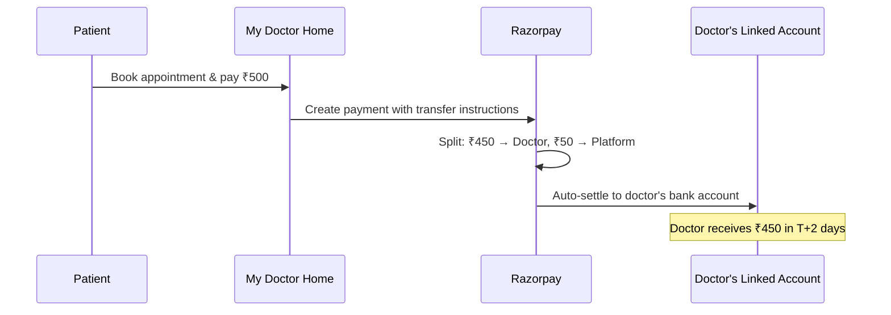
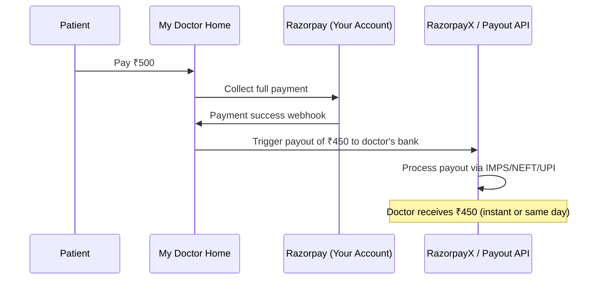

# Direct Doctor Payment — Solution Analysis

## The Problem

**Current flow:**
```
Patient → pays fees → SuperAdmin account → (after 1 month) → Doctor account
```

**Desired flow:**
```
Patient → pays fees → Doctor account (directly)
```

**Core challenge:** Creating a separate Razorpay account/ID for each doctor is impractical and doesn't scale.

---

## 🏆 Solution 1: Razorpay Route (Recommended)

This is the **industry-standard solution** for exactly your problem. Razorpay built this product specifically for marketplace/platform businesses like yours.

### How It Works



### Key Concepts

| Concept | What It Means |
|---------|---------------|
| **Your Account** | One single Razorpay account (SuperAdmin's) |
| **Linked Accounts** | Sub-accounts created for each doctor — **NOT separate Razorpay IDs** |
| **Route/Transfer** | Automatic split of payment at transaction time |
| **Settlement** | Doctor's share goes directly to their bank (T+2 days) |

### Why This Solves Your Problem

- ❌ You do **NOT** need separate Razorpay IDs for each doctor
- ✅ Doctors are onboarded as **Linked Accounts** under YOUR single Razorpay account
- ✅ No limit on number of Linked Accounts
- ✅ No setup fee or AMC for creating Linked Accounts
- ✅ Standard transaction fee (~2% + GST) applies per transaction
- ✅ KYC for doctors can be done via API (PAN + bank details)

### Payment Flow (Technical)

```
1. Doctor registers on your platform
   → You call Razorpay API to create a "Linked Account"
   → Doctor provides: Name, PAN, Bank Account, IFSC
   → Razorpay returns an `account_id`

2. Patient pays for consultation
   → You create a payment order WITH transfer instructions
   → Specify: 80% to doctor's account_id, 20% to your platform
   → Patient pays normally (UPI/Card/NetBanking)

3. After successful payment
   → Razorpay automatically splits the money
   → Doctor's share settles to their bank in T+2 days
   → Your commission stays in your Razorpay account
```

### Pros & Cons

| Pros | Cons |
|------|------|
| Purpose-built for this exact use case | Requires Razorpay Route activation (contact sales) |
| No separate accounts needed | Doctor KYC required (PAN + bank) |
| Automatic splitting & settlement | ~2% + GST transaction fee |
| Handles refunds & reversals | T+2 settlement (not instant) |
| RBI compliant | Need to handle KYC failures gracefully |

---

## Solution 2: Cashfree Easy Split

An alternative to Razorpay Route, particularly strong for payouts.

### How It Works

Same concept as Razorpay Route — you onboard doctors as "sub-merchants" and split payments at transaction time.

| Feature | Cashfree Easy Split |
|---------|-------------------|
| Sub-merchant onboarding | API-based, similar to Razorpay |
| Split at payment time | ✅ Yes |
| Settlement speed | T+1 or T+2 |
| Pricing | Competitive with Razorpay |
| Instant payouts | ✅ Available (extra fee) |

### When to choose Cashfree over Razorpay
- If Razorpay Route activation is delayed
- If you want faster settlements (T+1)
- If you need instant payouts to doctors

---

## Solution 3: Collect & Auto-Payout (Hybrid Approach)

If you want to stay with your current Razorpay setup and avoid Route:

### How It Works



### Key Idea
- Collect payment normally in your Razorpay account
- Use **RazorpayX Payouts API** to instantly transfer doctor's share to their bank
- You only need doctor's bank details (account number + IFSC) or UPI ID

| Pros | Cons |
|------|------|
| Works with existing Razorpay setup | Money briefly passes through your account |
| No Linked Account KYC needed | You handle the splitting logic |
| Can do instant payouts | Extra payout fees (₹2-5 per IMPS/UPI) |
| Simple to implement | Regulatory risk (you're holding funds) |

> [!WARNING]
> This approach means money flows through your account first, which is exactly what you're trying to avoid. It also carries **regulatory risk** under RBI Payment Aggregator guidelines if you hold funds for too long.

---

## Solution 4: UPI Collect to Doctor Directly

A creative low-tech solution.

### How It Works
- When patient books, generate a **UPI payment link** with the doctor's UPI ID as the payee
- Patient pays directly to doctor's UPI
- Your platform collects commission separately (monthly invoice to doctor)

| Pros | Cons |
|------|------|
| Truly direct (no middleman) | Hard to track/verify payments |
| Zero platform fees on transaction | Commission collection is manual |
| No KYC or onboarding | No refund control |
| Works immediately | Poor user experience |

> [!CAUTION]
> This approach sacrifices control over the payment flow and makes it very difficult to handle refunds, disputes, and financial reporting. **Not recommended for a professional platform.**

---

## 🔍 How Real Platforms Solve This

| Platform | Approach | Details |
|----------|----------|---------|
| **Practo** | Collect + Settle | Collects full amount, settles to doctors weekly |
| **Zocdoc** | Subscription model | Charges doctors a SaaS fee, patient pays doctor directly at clinic |
| **Urban Company** | Razorpay Route | Uses split payments, professionals are Linked Accounts |
| **Swiggy/Zomato** | Payment Gateway Route | Marketplace split — restaurant gets their share automatically |
| **Stripe Connect** (global) | Connected Accounts | Same concept as Razorpay Route, used by Doctolib (EU) |

---

## My Recommendation

```
                    ┌─────────────────────────────────────────┐
                    │                                         │
                    │   🏆  Go with Razorpay Route            │
                    │                                         │
                    │   • You already use Razorpay             │
                    │   • It's built for YOUR exact use case   │
                    │   • No separate Razorpay IDs needed      │
                    │   • Linked Accounts are FREE to create   │
                    │   • API-driven doctor onboarding         │
                    │   • Automatic split & settlement         │
                    │   • RBI compliant                        │
                    │                                         │
                    └─────────────────────────────────────────┘
```

### Implementation Effort (Razorpay Route)

| Step | Effort | Details |
|------|--------|---------|
| Enable Route on Razorpay dashboard | 1-2 days | Contact Razorpay sales, may need business docs |
| Build doctor onboarding flow (KYC) | 2-3 days | Collect PAN, bank details, create Linked Account via API |
| Modify payment flow | 2-3 days | Add transfer instructions to payment creation |
| Build settlement dashboard | 2-3 days | Show doctors their earnings & settlement status |
| Testing & edge cases | 2-3 days | Refunds, failed KYC, partial transfers |
| **Total** | **~10-14 days** | |

### What You Need from Each Doctor

1. **Legal name** (as on PAN card)
2. **PAN number**
3. **Bank account number + IFSC code**
4. **Email address** (unique per doctor)
5. **Phone number**

---

## Open Questions for You

1. **Commission model** — Do you charge doctors a fixed fee per consultation or a percentage?
2. **Settlement frequency** — Are doctors okay with T+2 day settlement, or do they need instant payouts?
3. **Existing Razorpay plan** — What's your current Razorpay plan? Route may require a business upgrade.
4. **Number of doctors** — How many doctors are currently on the platform? (Affects onboarding strategy)
5. **Refund handling** — When a patient cancels, should the refund come from doctor's share or platform's share?
