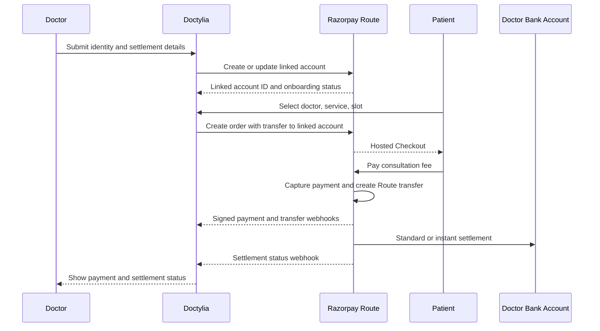

# Payment Gateway Project Scope

## Razorpay Route Linked Accounts and Direct Doctor Settlement

**Project:** My Doctor Home / Doctylia
**Status:** Proposed implementation scope
**Date:** 2026-08-24
**Primary provider:** Razorpay Route
**Settlement target:** Doctor linked account, with Linked Instant Settlements when approved and enabled

## 1. Objective

Replace the current patient payment flow:

```text
Patient -> Doctylia platform Razorpay account -> monthly RazorpayX payout -> Doctor
```

with the target flow:

```text
Patient -> Razorpay Checkout -> Razorpay Route transfer -> Doctor linked account -> Doctor bank account
```

The platform will continue to use one Razorpay platform account. Each doctor will be onboarded as a Razorpay Route linked account rather than receiving a separate Razorpay merchant account.

The application must support standard linked-account settlement as the baseline. Instant settlement is an optional provider capability and may only be shown as active after Razorpay approves and enables Linked Instant Settlements for the platform account and eligible doctors.

## 2. Current System and Gap

The repository already contains:

- `create-razorpay-order` for patient order creation.
- `verify-razorpay-payment` for signature verification, appointment creation, and ledger insertion.
- `razorpay-webhook` for payment and payout event processing.
- `add-doctor-bank-account` for the current RazorpayX bank/UPI payout setup.
- `calculate-monthly-earnings` and `create-doctor-payout` for delayed monthly payouts.
- `refund-payment`, which currently supports mock refunds but returns `501` for real Razorpay refunds.
- `payments`, `doctor_ledger`, `payouts`, and `doctor_bank_accounts` tables.
- A mock payment mode used to exercise the same booking flow without moving real money.

The current consultation flow still creates a normal platform Razorpay order and records the doctor's amount in an internal ledger. The new design must add Route transfer instructions at order creation and make Razorpay's transfer and settlement events authoritative for the doctor-side payment status.

Subscription and plan-upgrade payments remain platform payments and are outside this migration.

## 3. Product and Financial Decisions

### Included decisions

- Consultation payments are processed in INR through Razorpay Checkout.
- The platform keeps no per-consultation commission. The doctor share equals the consultation amount unless a later approved business decision changes this.
- Razorpay transaction fees and any instant-settlement fees are tracked separately from the consultation amount and are not silently deducted from the doctor's displayed earnings.
- A doctor cannot receive Route transfers until their linked account is active and eligible.
- Standard settlement is the fallback when instant settlement is unavailable.
- Appointment confirmation still depends on verified payment, not on the browser callback alone.
- Razorpay webhooks are a required server-to-server confirmation path.

### Not included

- Replacing Razorpay with Cashfree, Stripe, or direct UPI collection.
- Creating independent Razorpay merchant accounts for doctors.
- Routing doctor subscription fees through linked accounts.
- Building a custom wallet or holding balance system.
- Treating RazorpayX monthly payouts as the primary path for new consultation payments.

## 4. Target Architecture



### Ownership boundaries

| Responsibility | Owner |
|---|---|
| Checkout UI and booking experience | React frontend and Razorpay Checkout |
| Razorpay secrets and API calls | Supabase Edge Functions only |
| Linked-account onboarding state | Supabase database plus Route API |
| Payment verification | Edge Function using Razorpay signature verification |
| Transfer and settlement truth | Razorpay webhook payloads reconciled into database |
| Appointment creation | Existing verified-payment path |
| Doctor and superadmin reporting | Existing admin surfaces extended for transfer data |
| Provider activation, limits, fees, and KYC decisions | Razorpay and platform operations |

## 5. Scope of Work

### 5.1 Razorpay account activation

Before production implementation is enabled:

1. Activate Razorpay Route on the platform account.
2. Request Linked Instant Settlements separately.
3. Confirm the exact linked-account onboarding API, required KYC fields, supported settlement modes, event names, fee schedule, refund behavior, and account eligibility rules with Razorpay.
4. Configure test and production webhook endpoints and secrets.
5. Confirm whether the platform's current Razorpay account and healthcare use case are eligible for Route and instant settlement.

The application must not report instant settlement as guaranteed based only on configuration. The UI must display `pending`, `standard`, `instant`, `failed`, or `unavailable` according to stored provider status.

### 5.2 Doctor linked-account onboarding

Add a doctor-facing and superadmin-visible onboarding workflow that collects only the information required by Razorpay:

- Legal name and beneficiary name.
- PAN/KYC information required by Razorpay.
- Doctor email and phone number.
- Bank account number, IFSC, and account type, or another Route-supported settlement destination.
- Consent to use the details for payment settlement.

The workflow must:

- Validate all fields server-side as well as in the client.
- Create or update the linked account through a protected Edge Function.
- Store the Razorpay linked `account_id`, onboarding status, KYC status, and last provider error.
- Support retry after a correctable KYC or bank-verification failure.
- Prevent payment order creation when the linked account is not eligible for transfer.
- Mask bank details in doctor and admin views.
- Avoid logging PAN, full account numbers, API credentials, or raw sensitive provider payloads.

The existing `doctor_bank_accounts` table and RazorpayX fund-account fields must not be treated as equivalent to a Route linked account. A migration should add explicit Route identifiers and status fields rather than overloading payout terminology.

### 5.3 Patient order creation with Route transfer

Update `create-razorpay-order` to:

1. Validate doctor, service, amount, and slot as it does today.
2. Load the doctor's active Route linked-account record.
3. Reject or safely fall back according to an explicit platform policy if no eligible linked account exists. The default production policy is to reject online payment and offer contact-the-clinic booking; it must not silently collect into the old platform-only flow.
4. Create the Razorpay order in paise with transfer instructions for the doctor's full consultation amount.
5. Persist the internal payment row and the provider order/transfer references before returning the order to the client.
6. Preserve mock mode with the same response shape and state transitions, but never pretend that a mock transfer settled a real bank account.

The amount used for the transfer must be calculated server-side from trusted service data. The client must not choose the doctor's transfer amount, commission, settlement mode, or linked account ID.

### 5.4 Payment verification and appointment creation

Retain the existing pay-first rule:

- Do not create an appointment before payment is verified.
- Verify the Razorpay checkout signature on the server.
- Make verification idempotent for duplicate browser callbacks and webhooks.
- Keep the pending booking payload tied to the internal payment row.
- If payment is captured but appointment creation fails, flag the payment for refund/recovery and preserve the full audit trail.

After successful payment verification:

- Mark the payment as captured.
- Create the appointment once.
- Create one doctor ledger entry with gross amount, doctor share, fees if available, and transfer reference.
- Do not mark the ledger as paid merely because the payment was captured. Doctor settlement status must be updated from Route transfer/settlement events.

### 5.5 Webhooks and reconciliation

Extend `razorpay-webhook` to support the provider events confirmed during Route activation, including the applicable payment, transfer, settlement, refund, and failure events.

Webhook requirements:

- Read the raw request body for signature verification.
- Verify `x-razorpay-signature` before processing.
- Store a provider event ID and reject duplicate processing safely.
- Resolve the internal payment using provider order, payment, transfer, or settlement references.
- Use an explicit state-transition policy so late or out-of-order events cannot move a row backward incorrectly.
- Persist the raw payload only when it is safe and appropriately redacted.
- Return a retryable non-2xx response for signature or temporary processing failures according to Razorpay's webhook retry expectations.
- Provide a reconciliation job or protected admin action to compare captured payments, transfers, and settlements against local records.

The webhook path is authoritative for cases where the patient closes Checkout, loses network connectivity, or the browser callback is never received.

### 5.6 Refunds, reversals, and exceptions

Replace the current live-mode `501` behavior in `refund-payment` with a real Razorpay refund flow after the Route refund contract is confirmed.

The design must define and test:

- Full refund before doctor settlement.
- Full refund after doctor settlement.
- Partial refund, if supported for the order/transfer structure.
- Transfer reversal when a refund requires recovering the doctor's share.
- Failed or delayed reversal.
- Payment captured but transfer not created.
- Transfer created but settlement failed.
- Captured payment with no appointment because the slot was taken.
- Duplicate refund requests.

Every refund must be idempotent, admin-authorized, linked to the original payment, and visible to the patient, doctor, and superadmin at the appropriate level.

### 5.7 Admin and doctor experience

Extend existing payment and payout views to show:

- Route linked-account status and KYC status.
- Doctor settlement readiness.
- Payment status and provider references.
- Transfer status separately from payment status.
- Settlement mode: standard or instant.
- Settlement status and timestamp.
- Refund and reversal status.
- Failed actions with a human-readable next step.
- Test-mode data clearly separated from live financial data.

The existing monthly calculation and RazorpayX payout screens should remain available only for legacy records and an explicit fallback/recovery process. They must not imply that new Route payments require a monthly payout approval.

## 6. Proposed Data Model Changes

The exact migration must be produced after confirming the Route API contract, but it should introduce explicit concepts similar to these:

### Doctor Route account

- `razorpay_route_account_id`
- `route_account_status`
- `route_kyc_status`
- `route_settlement_mode`
- `route_onboarding_error`
- `route_last_synced_at`
- `route_is_mock`

### Payment transfer

- `razorpay_transfer_id`
- `transfer_status`
- `transfer_amount`
- `transfer_currency`
- `transfer_created_at`
- `transfer_settled_at`
- `settlement_mode`
- `settlement_status`
- `settlement_failure_reason`

### Refund and webhook idempotency

- `razorpay_refund_id`
- `refund_status`
- `refund_amount`
- `refund_failure_reason`
- A webhook-events table with unique provider event ID, event type, received time, processed time, and processing result.

All monetary values must use fixed-precision numeric database columns and integer paise for provider API payload calculations. Sensitive bank and KYC data must be minimized, encrypted/tokenized where required, and excluded from ordinary application logs.

Generated Supabase types must be regenerated through the project workflow after migrations. `src/integrations/supabase/client.ts` and `types.ts` must not be hand-edited.

## 7. Payment State Model

Payment capture and doctor settlement are separate states:

```text
created
  -> authorized
  -> captured
  -> transfer_pending
  -> transfer_created
  -> settlement_pending
  -> settled
```

Failure paths include:

```text
created -> failed
authorized -> failed
captured -> refund_pending -> refunded
transfer_pending -> transfer_failed
settlement_pending -> settlement_failed
settled -> reversal_pending -> reversed or reversal_failed
```

The final enum values must match the chosen database migration and the provider's actual event model. A captured payment must never be presented as settled until a trusted transfer/settlement event confirms it.

## 8. Security and Compliance Requirements

- Keep `RAZORPAY_KEY_SECRET`, webhook secrets, and service-role credentials in server-side environment secrets only.
- Never call Razorpay Route account or order APIs directly from the browser.
- Authorize doctor onboarding updates to the signed-in doctor or an approved superadmin role.
- Authorize refund and reconciliation actions server-side.
- Verify webhook signatures against the raw body.
- Add replay protection and provider event idempotency.
- Apply least-privilege RLS policies to new tables.
- Restrict sensitive settlement details to the doctor and authorized superadmin roles.
- Mask account numbers and PAN in UI, exports, logs, and error messages.
- Review the healthcare marketplace and payment-aggregation obligations with qualified legal/compliance advisors before production launch.
- Do not describe instant settlement as guaranteed; it depends on Razorpay approval, account eligibility, fees, limits, and service availability.

## 9. Implementation Phases

### Phase 0: Provider and contract validation

- Obtain Route and Linked Instant Settlements approval.
- Confirm official API endpoints, payload shape, supported events, refund/reversal rules, pricing, limits, and test credentials.
- Document the final provider contract in the repository.

### Phase 1: Data and onboarding foundation

- Add Route account, transfer, settlement, refund, and webhook-event schema.
- Build protected linked-account onboarding and status synchronization.
- Add masking and access controls.
- Keep mock mode capable of testing onboarding and all state transitions.

### Phase 2: Route payment flow

- Add server-side transfer instructions to order creation.
- Extend payment verification and ledger records.
- Add transfer and settlement webhook processing.
- Add reconciliation for missing or out-of-order events.

### Phase 3: Refunds and operations

- Implement live full/partial refund behavior supported by Razorpay.
- Implement reversal and exception workflows.
- Update doctor and superadmin reporting.
- Mark the legacy monthly payout path as legacy and prevent accidental use for new Route payments.

### Phase 4: Production rollout

- Test in Razorpay test mode with a dedicated test doctor.
- Pilot with a small number of real doctors.
- Monitor webhook delivery, transfer failures, refunds, and settlement timing.
- Enable instant settlement only after standard Route settlement is verified and Razorpay approval is confirmed.

## 10. Testing and Acceptance Criteria

### Automated tests

- Linked-account onboarding validation and authorization.
- Order creation rejects doctors without an eligible linked account.
- Server calculates the transfer amount and ignores client-supplied split values.
- Signature verification rejects tampered callbacks and webhooks.
- Duplicate callback and duplicate webhook processing are idempotent.
- Captured payment creates one appointment and one ledger row.
- Captured payment with a lost slot is flagged for refund/recovery.
- Transfer and settlement events update the correct payment and ledger records.
- Late events cannot regress a settled or refunded record.
- Full, partial, failed, and duplicate refunds behave according to the provider contract.
- Mock mode exercises success, failure, timeout, transfer failure, settlement failure, and refund paths without external money movement.
- RLS prevents cross-doctor access to settlement details.

### Production acceptance criteria

- A real test payment creates a Route transfer to the intended doctor linked account.
- The doctor does not require a separate Razorpay merchant account.
- The appointment is created exactly once after verified capture.
- Doctor and superadmin views distinguish captured, transferred, settled, refunded, and failed states.
- Standard settlement works even when instant settlement is disabled.
- Instant settlement is displayed only for eligible accounts and confirmed provider status.
- Refunds and transfer reversals leave a complete auditable record.
- No patient or doctor payment is silently routed through the old monthly payout flow after cutover.
- No secrets or unmasked bank/KYC data appear in logs or client responses.

## 11. Rollback and Migration Strategy

- Keep existing payment records readable and clearly tagged as legacy or Route-based.
- Do not alter historical payment amounts or ledger records during migration.
- Feature-flag Route order creation per environment and, if needed, per doctor cohort.
- If Route is unavailable, disable online payment for affected doctors rather than silently reverting to platform collection without an approved policy.
- Keep legacy RazorpayX payout tools available for pre-cutover records and manual recovery only.
- Reconcile every captured legacy payment before marking the old flow retired.

## 12. External Documentation and References

- [Razorpay Route](https://razorpay.com/docs/payments/route/)
- [Razorpay Instant Settlements](https://razorpay.com/docs/payments/instant-settlement/)
- [Razorpay dashboard](https://dashboard.razorpay.com)
- [Existing payment architecture analysis](payment_architecture_analysis.md)
- [Existing Razorpay Route setup guide](razorpay_route_setup_guide.md)

The linked documentation is the starting reference, not a substitute for confirming the current Route API and account-specific eligibility with Razorpay. Provider payloads and event names must be validated before implementation is merged or production credentials are enabled.

## 13. Definition of Done

This project is complete when the application can onboard an eligible doctor to a Route linked account, create a patient order that transfers the consultation amount to that account, verify the payment server-side, reconcile transfer and settlement webhooks, process supported refunds/reversals, expose accurate statuses to authorized users, and pass the automated and production acceptance criteria above.